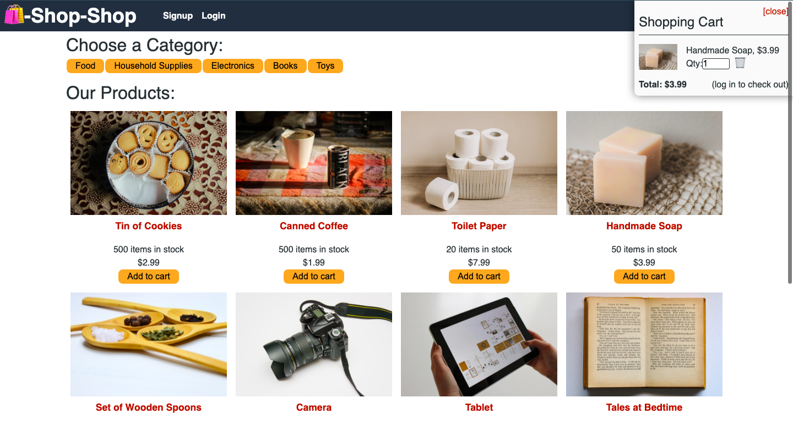

# 22. State Challenge: Redux Store

## Description

This project was a continuation of the asynchronous work done in Module 22. The application was originally set up to implement global state within React using the createContext and useConext hooks from React, and was refactored to instead use Redux to manage global state.

## Table of Contents

* [Usage](#usage)
* [Deployment](#deployment)
* [License](#license)
* [Credits](#credits)
* [Authors](#authors)
* [Questions](#questions)

## Usage

Create an account by clicking the "Login/Sign Up" link in the top left. You can then browse the items in the shop, click individual items to see them in detail, and add items to your cart. This application is simply a demo so you can't purchase the items, but clicking checkout in the cart simulates payment through Stripe. Any payment information won't be saved and you will not be charged.

## Deployment

The deployed application can be found [here]().

## License

[MIT](./LICENSE.txt)

## Credits

Starter Code

* The code used from the module can be found in this [feature branch](https://github.com/aidanamato/shop-shop/tree/feature/no-redux).

Technologies

* [Node.js](https://nodejs.org/en/)
* [React](https://reactjs.org/)
* [MongoDB](https://www.mongodb.com/)
* [GraphQL](https://graphql.org/)

NPM Dependencies

* [Express](https://www.npmjs.com/package/express)
* [bcrypt](https://www.npmjs.com/package/bcrypt)
* [jsonwebtoken](https://www.npmjs.com/package/jsonwebtoken)
* [@apollo/client](https://www.npmjs.com/package/@apollo/client)
* [stripe](https://www.npmjs.com/package/stripe)
* [redux](https://www.npmjs.com/package/redux)
* [react-redux](https://www.npmjs.com/package/react-redux)

## Authors

Aidan Amato

## Questions

Please reach out if you have any additional questions!

* [GitHub](https://github.com/aidanamato)
* [Email](mailto:aidanamato@comcast.net)